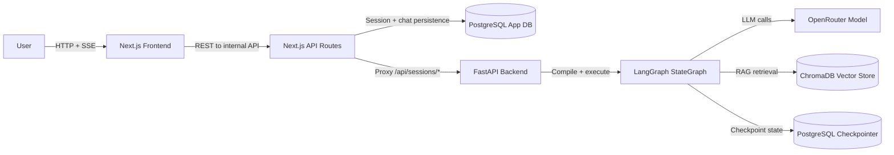
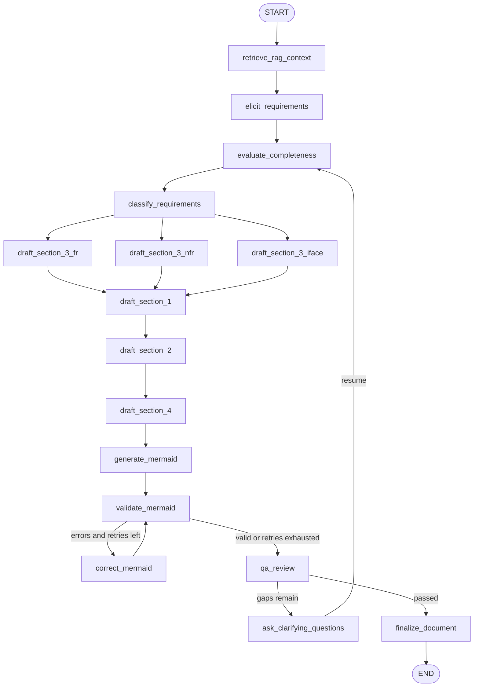

# AI-Driven SRS Generator

Automated Software Requirements Specification generator powered by **LangGraph**,
**FastAPI**, and **OpenRouter**. Converts a vague stakeholder idea into a full
IEEE 830-compliant SRS document via recursive multi-agent elicitation.

The retrieval corpus is pre-seeded with regulatory and standards guidance,
including HIPAA, GDPR, PCI-DSS, WCAG, IEEE 830, and an extended SRS authoring
template.

---

## Architecture



### Graph topology



---

## Setup

### 1. Prerequisites

- Python 3.11 or 3.13
- Docker (for PostgreSQL)
- Node.js + `npm install -g @mermaid-js/mermaid-cli` *(optional — enables strict Mermaid validation)*

### 2. Install dependencies

```powershell
# On Windows — install chromadb binary first (avoids C++ compiler requirement)
pip install chromadb --prefer-binary

# Then install everything else
pip install -r requirements.txt
```

### 3. Configure environment

```powershell
Copy-Item .env.example .env
# Edit .env and set OPENROUTER_API_KEY
```

### 4. Start PostgreSQL

```powershell
docker compose up -d
```

### 5. Start the server

```powershell
python -m app.main
```

Server starts at `http://localhost:8000`.
Interactive API docs: `http://localhost:8000/docs`

### 6. Start the frontend

```powershell
cd frontend
npm install
npm run prisma:generate
npm run dev
```

Frontend runs at `http://localhost:3000`.

If this is your first frontend run, initialize auth/chat tables once:

```powershell
cd ..
docker compose exec -T postgres psql -U srs_user -d srs_db -f frontend/prisma/init_auth_chat.sql
```

---

## API

| Method | Endpoint | Description |
|---|---|---|
| `POST` | `/api/sessions` | Create a new elicitation session |
| `POST` | `/api/sessions/{id}/interact` | Send a message; stream SSE response |
| `GET` | `/api/sessions/{id}/document` | Retrieve the completed SRS document |
| `GET` | `/api/sessions/{id}/state` | Debug — inspect graph state |
| `GET` | `/health` | Health check |

### SSE event types

| Event | Payload | Description |
|---|---|---|
| `token` | `{"content": "...", "node": "..."}` | Streamed LLM text chunk |
| `question` | `{"questions": [...], "prompt": "..."}` | Clarifying questions (HITL) |
| `status` | `{"node": "...", "status": "finished"}` | Node completion notification |
| `complete` | `{"document": "..."}` | Final SRS Markdown document |
| `error` | `{"message": "..."}` | Runtime error |

### Example flow

```bash
# 1. Create session
curl -X POST http://localhost:8000/api/sessions
# → {"thread_id": "<uuid>"}

# 2. Start elicitation (replace <thread_id>)
curl -X POST http://localhost:8000/api/sessions/<thread_id>/interact \
  -H "Content-Type: application/json" \
  -d '{"message": "I want to build a food delivery app for restaurants"}' \
  --no-buffer

# 3. Answer clarifying questions (uses same thread_id)
curl -X POST http://localhost:8000/api/sessions/<thread_id>/interact \
  -H "Content-Type: application/json" \
  -d '{"message": "Auth via email/password. Expect 10k daily users. GDPR applies."}' \
  --no-buffer

# 4. Retrieve final document
curl http://localhost:8000/api/sessions/<thread_id>/document
```

---

## Tests

```powershell
python -m pytest app/tests/ -v
```

## Requirement taxonomy labels

| Prefix | Category |
|---|---|
| `F` | Functional |
| `A` | Availability |
| `FT` | Fault Tolerance |
| `L` | Legal / Compliance |
| `LF` | Look & Feel |
| `MN` | Maintainability |
| `O` | Operational |
| `PE` | Performance |
| `PO` | Portability |
| `SC` | Scalability |
| `SE` | Security |
| `US` | Usability |
