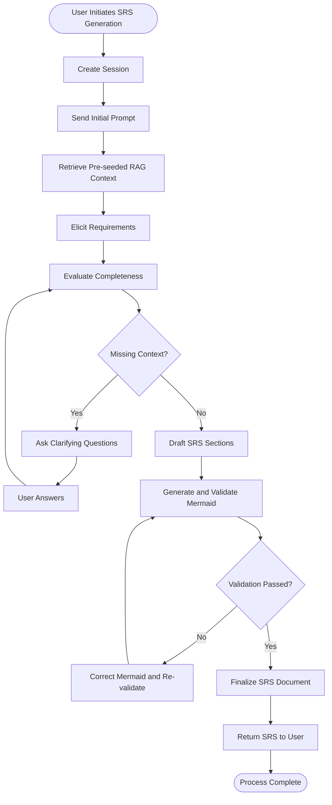

# Activity Diagram

This diagram shows the main activity flow of the automated SRS generator system.

## Process Description

1. **User Initiates SRS Generation** - User starts the process through the frontend
2. **Create Session** - Frontend creates a backend thread/session for graph execution
3. **Send Initial Prompt** - User provides initial product idea/requirements
4. **Retrieve Pre-seeded RAG Context** - Backend retrieves relevant seeded standards/regulatory context from vector store
5. **Elicit Requirements** - Graph transforms input into structured requirement content
6. **Evaluate Completeness** - Graph checks for missing details
7. **Clarification Loop** - If gaps exist, system asks questions and user answers, then evaluation repeats
8. **Draft SRS Sections** - Graph drafts core SRS sections from collected context
9. **Generate and Validate Mermaid** - Diagrams are generated and syntax-validated, with correction retries if needed
10. **Finalize SRS Document** - Final document is assembled after QA/validation
11. **Return SRS to User** - Document is returned through the chat flow
