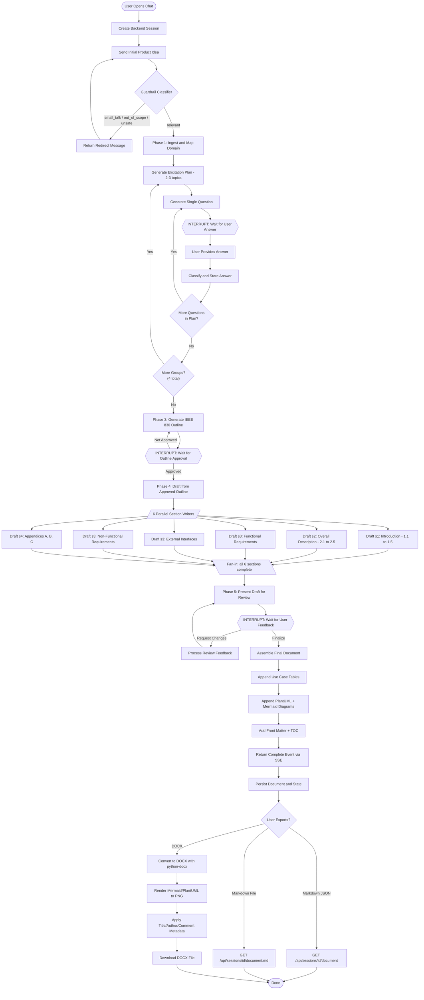
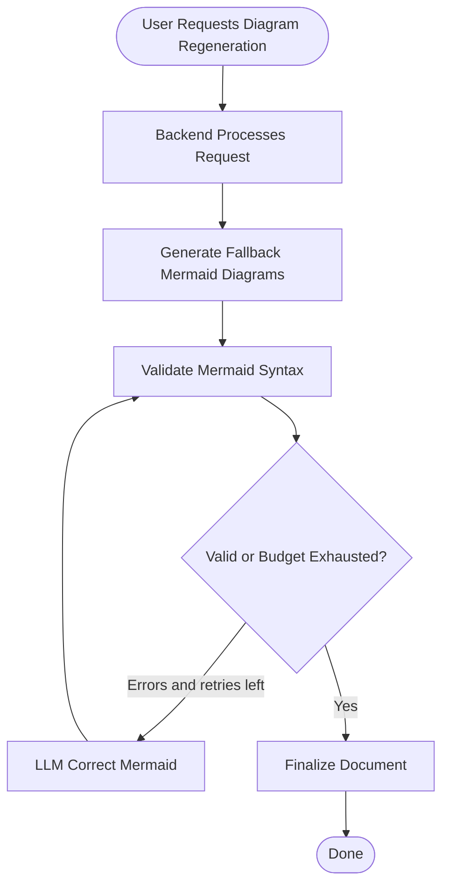
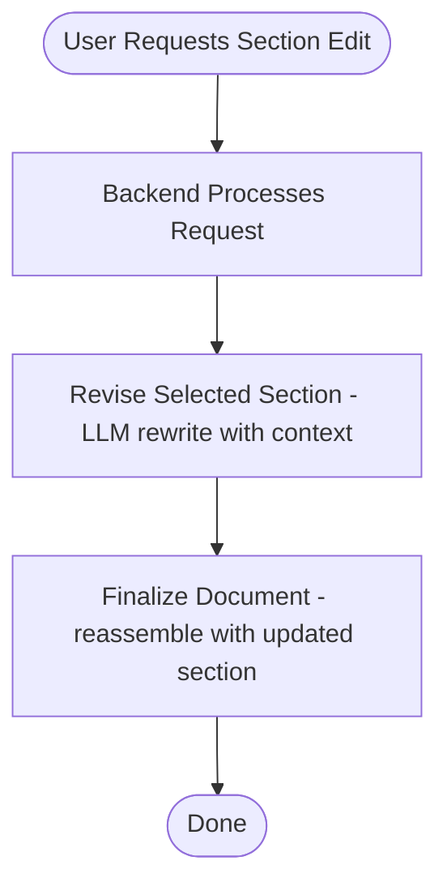

# Activity Diagram

This diagram shows the main activity flow of the automated SRS generator system, covering the three run modes (full flow, diagrams-only, section revision), the 6 parallel section writers, the 4-group elicitation with one-question-at-a-time interrupts, and the HITL outline/draft review interrupts.

## Full SRS Generation Flow

## Diagrams-Only Mode

## Section Revision Mode

## Elicitation Detail (Phase 2 - One Question at a Time)

```mermaid
flowchart TD
    Start([Enter Elicitation Phase]) --> Group0{"Group 0:<br/>User Roles & Flows"}

    Group0 -->|"2-3 questions"| Plan0[Generate Question Topics]
    Plan0 --> Q0_1[Ask Question 1]
    Q0_1 --> I0_1{{INTERRUPT: Wait for Answer}}
    I0_1 --> A0_1[Store Answer]
    A0_1 --> More0{More in Plan?}
    More0 -->|Yes| Q0_1
    More0 -->|No| Group1

    Group1{"Group 1:<br/>Functional Boundaries"} --> Plan1[Generate Question Topics]
    Plan1 --> Q1_1[Ask Question 1]
    Q1_1 --> I1_1{{INTERRUPT}}
    I1_1 --> A1_1[Store Answer]
    A1_1 --> More1{More in Plan?}
    More1 -->|Yes| Q1_1
    More1 -->|No| Group2

    Group2{"Group 2:<br/>Non-Functional Requirements"} --> Plan2[Generate Question Topics]
    Plan2 --> Q2_1[Ask Question 1]
    Q2_1 --> I2_1{{INTERRUPT}}
    I2_1 --> A2_1[Store Answer]
    A2_1 --> More2{More in Plan?}
    More2 -->|Yes| Q2_1
    More2 -->|No| Group3

    Group3{"Group 3:<br/>Edge Cases & Risk"} --> Plan3[Generate Question Topics]
    Plan3 --> Q3_1[Ask Question 1]
    Q3_1 --> I3_1{{INTERRUPT}}
    I3_1 --> A3_1[Store Answer]
    A3_1 --> More3{More in Plan?}
    More3 -->|Yes| Q3_1
    More3 -->|No| Done([Proceed to Outline Generation])
```

## Process Description

1. **Ingestion (Phase 1)** - LLM extracts structured project summary (domain, actors, flows, entities, constraints) from the user's initial informal product idea.

2. **Elicitation (Phase 2)** - 4 groups of questions (2-3 questions each), asked one at a time. Each question pauses via `interrupt()` and resumes when the user provides an answer. Answers accumulate in state.

3. **Outline Review (Phase 3)** - LLM generates an IEEE 830-compliant outline. User can approve, modify, or reject sections before drafting proceeds.

4. **Drafting (Phase 4)** - 6 parallel section writers draft simultaneously using `asyncio.gather`. Each returns structured subsections with explicit numbering.

5. **Review & Refine (Phase 5)** - User reviews the assembled draft. Can request section regeneration, inline edits, or finalize the document.

6. **Finalization** - Document is assembled with:
   - Use-case catalog and detail tables derived from ingestion data
   - PlantUML diagrams (usecase, component, sequence, activity) generated from domain data
   - Mermaid diagrams (flowchart, sequence, ER, class, state) as fallback
   - Front matter with project title, document info table, and table of contents

7. **Export** - Available formats:
   - Markdown JSON (`GET /api/sessions/{id}/document`)
   - Markdown file download (`GET /api/sessions/{id}/document.md`)
   - DOCX with embedded diagrams (`GET /api/sessions/{id}/document.docx`)
