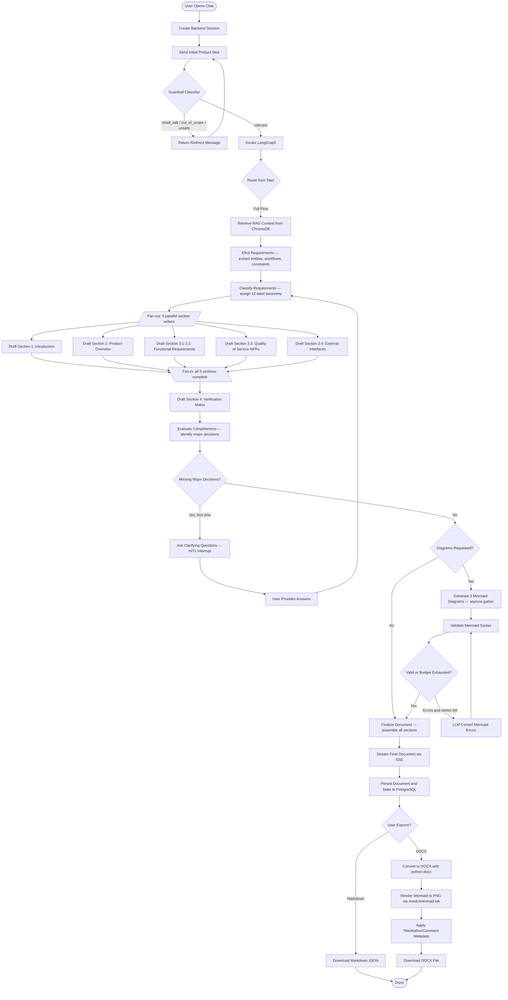
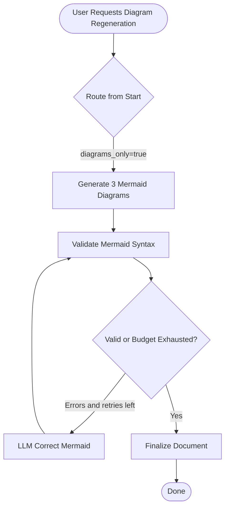
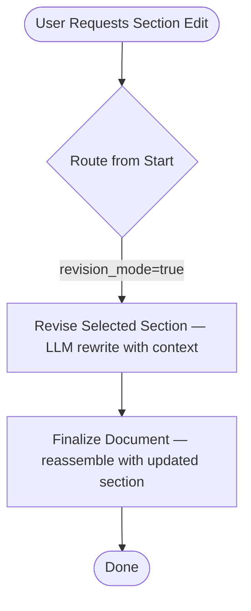

# Activity Diagram

This diagram shows the main activity flow of the automated SRS generator system,
covering the three run modes (full flow, diagrams-only, section revision), the
parallel fan-out of section writers, the Mermaid self-correction loop, and the
HITL clarification interrupt.

## Full SRS Generation Flow

## Diagrams-Only Mode

## Section Revision Mode

## Process Description

1. **User Opens Chat** — User accesses the chat workspace through the
   authenticated frontend.
2. **Create Backend Session** — Frontend creates a backend thread/session
   (UUID) for LangGraph graph execution and checkpointing.
3. **Send Initial Prompt** — User provides their product idea or requirements.
4. **Guardrail Classifier** — A lightweight LLM classifier screens the
   message. Small talk, out-of-scope, and unsafe messages receive redirect
   responses without invoking the graph.
5. **Route from Start** — The graph entry conditional edge routes to one of
   three modes: full flow, diagrams-only, or section revision.
6. **Retrieve RAG Context** — Semantic search against the ChromaDB collection
   seeded with IEEE 830, HIPAA, GDPR, PCI-DSS, WCAG, and SRS template
   documents.
7. **Elicit Requirements** — LLM extracts entities, workflows, and constraints
   from user input into a structured outline. Also infers a project title.
8. **Classify Requirements** — LLM assigns labels from the 12-category
   taxonomy (F, A, FT, L, LF, MN, O, PE, PO, SC, SE, US) to each requirement.
9. **Fan-out: 5 Parallel Section Writers** — LangGraph's `Send` API dispatches
   all five section writers simultaneously. Each reads shared state and writes
   to a distinct section key.
10. **Fan-in → Verification Matrix** — After all five writers complete,
    `draft_section_4` generates a verification matrix mapping requirement IDs
    to verification methods (Test / Analysis / Inspection / Demonstration).
11. **Evaluate Completeness** — LLM identifies 2–5 high-impact unresolved
    architectural decisions. If major decisions are missing (and haven't been
    asked before), the graph interrupts for clarification.
12. **Clarification Loop (HITL)** — The graph pauses via `interrupt()`, sends
    questions to the user via SSE, and resumes when answers arrive. The flow
    re-enters at `classify_requirements` to redraft with enriched context.
13. **Mermaid Diagram Pipeline** — Three diagrams (architecture flowchart,
    sequence, ER) are generated concurrently via `asyncio.gather`, validated
    via `mmdc` or heuristic fallback, and corrected up to `MAX_MERMAID_RETRIES`
    times if errors exist.
14. **Finalize Document** — All section drafts and diagrams are assembled into
    the final Markdown SRS document.
15. **Export** — User can download as Markdown JSON or as DOCX with formatted
    text, embedded diagram PNGs, and configurable metadata.
