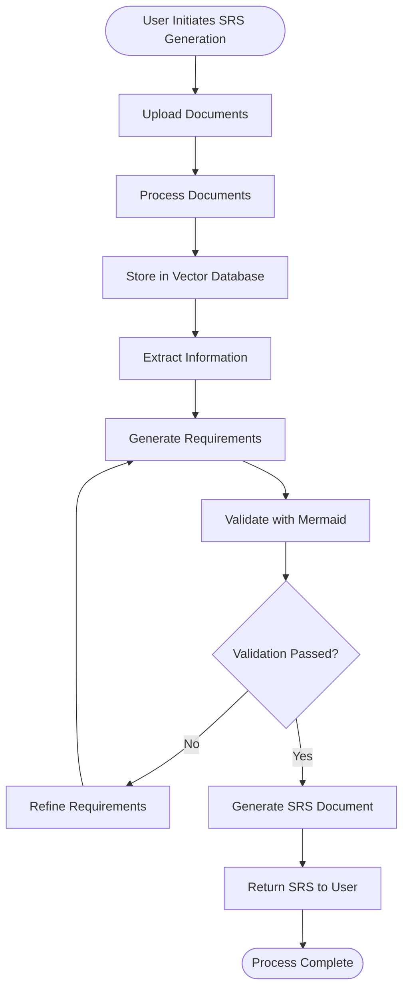

# Activity Diagram

This diagram shows the main activity flow of the automated SRS generator system.

## Process Description

1. **User Initiates SRS Generation** - User starts the process through the frontend
2. **Upload Documents** - User uploads seed documents (GDPR, HIPAA, etc.)
3. **Process Documents** - Backend processes uploaded documents
4. **Store in Vector Database** - Documents are embedded and stored in vector store
5. **Extract Information** - Graph nodes extract relevant information
6. **Generate Requirements** - Requirements are generated based on extracted info
7. **Validate with Mermaid** - Generated requirements are validated
8. **Validation Check** - If validation fails, refine requirements; otherwise continue
9. **Generate SRS Document** - Final SRS document is assembled
10. **Return SRS to User** - Document is returned to the user
