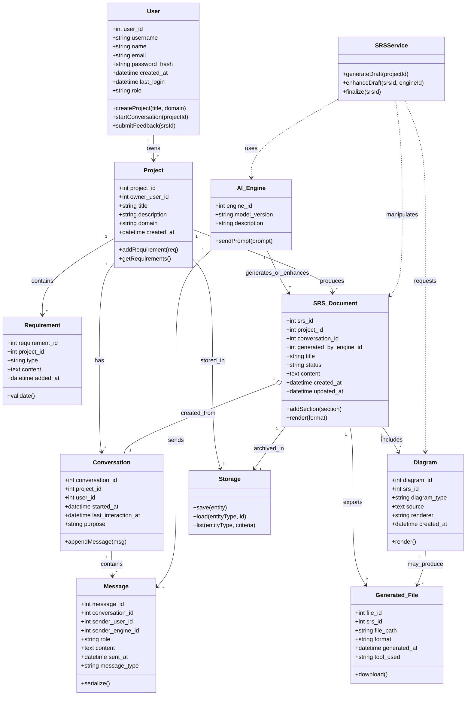

# Class Diagram

This diagram models the core domain classes for the Automated SRS Generator.

```mermaid
classDiagram

	%% Classes with attributes and representative operations
	class User {
		+int user_id
		+string username
		+string name
		+string email
		+string password_hash
		+datetime created_at
		+datetime last_login
		+string role
		+createProject(title, domain)
		+startConversation(projectId)
		+submitFeedback(srsId)
	}

	class Project {
		+int project_id
		+int owner_user_id
		+string title
		+string description
		+string domain
		+datetime created_at
		+addRequirement(req)
		+getRequirements()
	}

	class Requirement {
		+int requirement_id
		+int project_id
		+string type
		+text content
		+datetime added_at
		+validate()
	}

	class Conversation {
		+int conversation_id
		+int project_id
		+int user_id
		+datetime started_at
		+datetime last_interaction_at
		+string purpose
		+appendMessage(msg)
	}

	class Message {
		+int message_id
		+int conversation_id
		+int sender_user_id
		+int sender_engine_id
		+string role
		+text content
		+datetime sent_at
		+string message_type
		+serialize()
	}

	class SRS_Document {
		+int srs_id
		+int project_id
		+int conversation_id
		+int generated_by_engine_id
		+string title
		+string status
		+text content
		+datetime created_at
		+datetime updated_at
		+addSection(section)
		+render(format)
	}

	class Diagram {
		+int diagram_id
		+int srs_id
		+string diagram_type
		+text source
		+string renderer
		+datetime created_at
		+render()
	}

	class Generated_File {
		+int file_id
		+int srs_id
		+string file_path
		+string format
		+datetime generated_at
		+string tool_used
		+download()
	}

	class AI_Engine {
		+int engine_id
		+string model_version
		+string description
		+sendPrompt(prompt)
	}

	class Storage {
		+save(entity)
		+load(entityType, id)
		+list(entityType, criteria)
	}

	%% Associations (multiplicities approximate the ERD semantics)
	User "1" --> "*" Project : owns
	Project "1" --> "*" Requirement : contains
	Project "1" --> "*" Conversation : has
	Conversation "1" --> "*" Message : contains
	AI_Engine "1" --> "*" Message : sends
	AI_Engine "1" --> "*" SRS_Document : generates_or_enhances
	SRS_Document "1" --> "*" Diagram : includes
	SRS_Document "1" --> "*" Generated_File : exports
	Project "1" --> "*" SRS_Document : produces
	Diagram "1" --> "*" Generated_File : may_produce

	%% Useful navigational associations / composition
	SRS_Document "1" o-- "1" Conversation : created_from
	Project "1" --> "1" Storage : stored_in
	SRS_Document "1" --> "1" Storage : archived_in

	%% Small note-style class to show controller/service responsibilities
	class SRSService {
		+generateDraft(projectId)
		+enhanceDraft(srsId, engineId)
		+finalize(srsId)
	}

	SRSService ..> AI_Engine : uses
	SRSService ..> SRS_Document : manipulates
	SRSService ..> Diagram : requests

```
