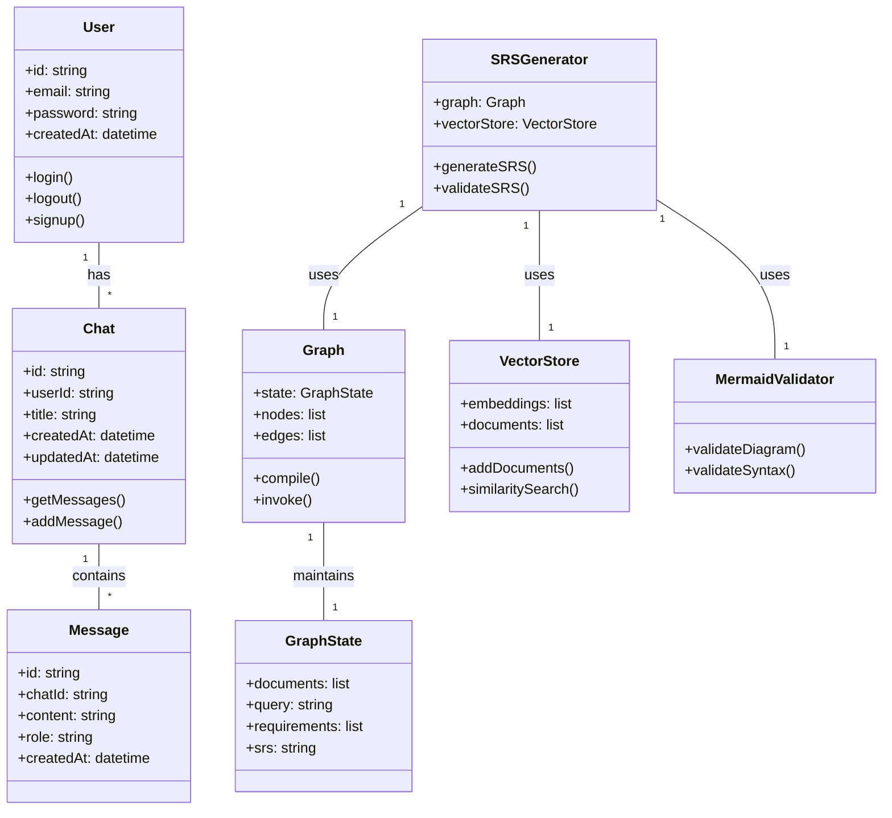

# Class Diagram

This diagram shows the main classes and their relationships in the system.

## Class Descriptions

- **User** - Represents system users with authentication
- **Chat** - Represents a chat session for SRS generation
- **Message** - Individual messages within a chat
- **Graph** - LangGraph workflow for SRS generation
- **GraphState** - State management for the graph
- **VectorStore** - Manages document embeddings and retrieval
- **SRSGenerator** - Main orchestrator for SRS generation
- **MermaidValidator** - Validates generated Mermaid diagrams
