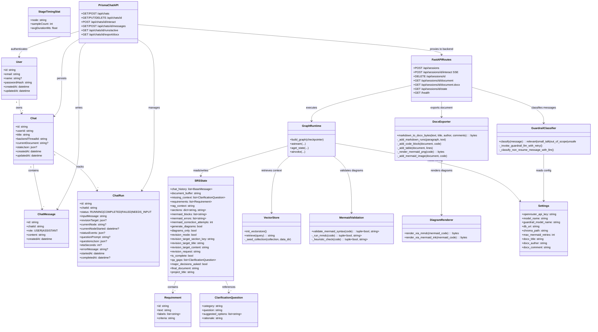

# Class Diagram

This diagram shows the main implemented models, state types, and core runtime
components of the SRS generator system.

## Class Descriptions

- **User / Chat / ChatMessage / ChatRun / StageTimingStat** - Persisted Prisma
  models used by the Next.js frontend. ChatRun tracks graph execution state for
  the active run. StageTimingStat records average node durations for ETA calculation.
- **Requirement** - Atomic requirement with a taxonomy-prefixed ID (e.g. `F-001`),
  descriptive text, classification labels, and a boolean-testable acceptance criterion.
- **ClarificationQuestion** - Structured follow-up question with category, question
  text, suggested options, and rationale for asking.
- **SRSState** - Full typed state passed through every LangGraph node. Uses
  `add_messages` reducer for `chat_history` and `merge_sections` dict reducer for
  `sections`. All other fields use simple replacement.
- **GraphRuntime** - Compiled LangGraph `StateGraph` workflow built by `build_graph()`.
  Supports `astream()` for SSE streaming and `aget_state()` for state inspection.
- **FastAPIRoutes** - Backend API router providing session lifecycle, SSE graph
  interaction, document retrieval, DOCX export, and debug state inspection.
- **GuardrailClassifier** - Lightweight LLM classifier that screens user messages
  before graph invocation. Uses a separate, cheaper model with retry logic and timeout.
- **PrismaChatAPI** - Next.js API routes that authenticate users via JWT, manage
  chats and messages via Prisma, and proxy graph interactions to the backend.
- **VectorStore** - ChromaDB-based retrieval over pre-seeded standards/compliance
  corpus (IEEE 830, HIPAA, GDPR, PCI-DSS, WCAG). Uses all-MiniLM-L6-v2 embeddings.
- **MermaidValidation** - Two-tier validation: `mmdc` subprocess (primary) with
  regex-based heuristic fallback. Returns `(valid, error_message)` tuple.
- **DocxExporter** - Converts Markdown to DOCX with formatted text (bold, italic,
  code, tables), embedded Mermaid diagram PNGs, and configurable document metadata.
- **DiagramRenderer** - Renders Mermaid code to PNG via `mmdc` CLI or `mermaid.ink`
  HTTP API fallback.
- **Settings** - Pydantic `BaseSettings` class reading `.env` configuration with
  LRU-cached singleton retrieval via `get_settings()`.
