# Class Diagram

This diagram shows the main implemented models, state types, and core runtime components of the SRS generator system.

```mermaid
classDiagram
    class User {
        +id: string
        +email: string
        +name: string?
        +passwordHash: string
        +createdAt: datetime
        +updatedAt: datetime
    }

    class Chat {
        +id: string
        +userId: string
        +title: string
        +backendThreadId: string
        +currentDocument: string?
        +stateJson: json?
        +createdAt: datetime
        +updatedAt: datetime
    }

    class ChatMessage {
        +id: string
        +chatId: string
        +role: USER|ASSISTANT
        +content: string
        +createdAt: datetime
    }

    class ChatRun {
        +id: string
        +chatId: string
        +status: RUNNING|COMPLETED|FAILED|NEEDS_INPUT
        +inputMessage: string
        +revisionTarget: json?
        +currentNode: string?
        +currentNodeStarted: datetime?
        +statusEvents: json?
        +questionPrompt: string?
        +questionsJson: json?
        +etaSeconds: int?
        +errorMessage: string?
        +startedAt: datetime
        +completedAt: datetime?
    }

    class StageTimingStat {
        +node: string
        +sampleCount: int
        +avgDurationMs: float
    }

    class CoreFlow {
        +name: string
        +goal: string
        +steps: list~string~
        +success_metric: string
    }

    class IngestionSummary {
        +project_title: string
        +domain: string
        +project_purpose: string
        +target_users: list~string~
        +suggested_actors: list~string~
        +platform_needs: list~string~
        +success_criteria: list~string~
        +architecture_summary: string
        +components: list~string~
        +core_flows: list~CoreFlow~
        +data_entities: list~string~
        +external_interfaces: list~string~
        +constraints: list~string~
        +assumptions: list~string~
    }

    class ClarificationQuestion {
        +category: string
        +group: int
        +priority: string
        +question: string
        +suggested_options: list~string~
        +rationale: string
    }

    class Requirement {
        +id: string
        +text: string
        +labels: list~string~
        +criteria: string
    }

    class IngestionSummaryModel {
        +project_title: string
        +domain: string
        +project_purpose: string
        +target_users: list~string~
        +suggested_actors: list~string~
        +platform_needs: list~string~
        +success_criteria: list~string~
        +architecture_summary: string
        +components: list~string~
        +core_flows: list~string~
        +data_entities: list~string~
        +external_interfaces: list~string~
        +constraints: list~string~
        +assumptions: list~string~
    }

    class ClarificationQuestionModel {
        +category: string
        +group: int
        +question: string
        +suggested_options: list~string~
        +rationale: string
    }

    class QuestionPlanModel {
        +topics: list~string~
    }

    class SubsectionContent {
        +number: string
        +title: string
        +content: string
    }

    class DraftSectionModel {
        +subsections: list~SubsectionContent~
    }

    class MermaidDiagramSet {
        +usecase: string
        +class_diagram: string
        +er: string
        +activity: string
    }

    class SRSState {
        +current_phase: string
        +ingestion_summary: dict
        +pending_group_index: int
        +elicitation_answers: dict
        +elicitation_question_plan: list~string~
        +elicitation_question_index: int
        +sections: dict~string, string~
        +section_structures: dict
        +plantumul_diagrams: dict~string, string~
        +mermaid_blocks: list~string~
        +mermaid_errors: list~string~
        +revision_targets: list~string~
        +chat_history: list~BaseMessage~
        +requirements: list~Requirement~
        +rag_context: string
    }

    class GraphRuntime {
        +build_graph(checkpointer)
        +astream(...)
        +aget_state(...)
        +adelete_thread(...)
    }

    class FastAPIRoutes {
        +POST /api/sessions
        +POST /api/sessions/id/interact SSE
        +DELETE /api/sessions/id
        +GET /api/sessions/id/document
        +GET /api/sessions/id/document.docx
        +GET /api/sessions/id/document.md
        +GET /api/sessions/id/state
        +GET /health
    }

    class GuardrailClassifier {
        +classify(message): relevant|small_talk|out_of_scope|unsafe
        -_invoke_guardrail_llm_with_retry()
        -_classify_non_resume_message_with_llm()
    }

    class PrismaChatAPI {
        +GET/POST /api/chats
        +GET/PUT/DELETE /api/chats/id
        +POST /api/chats/id/interact
        +GET/POST /api/chats/id/messages
        +GET /api/chats/id/runs/active
        +GET /api/chats/id/export/docx
    }

    class VectorStore {
        +init_vectorstore()
        +retrieve(query): string
        -_seed_collection(collection, data_dir)
    }

    class MermaidValidation {
        +validate_mermaid_syntax(code): tuple~bool, string~
        -_run_mmdc(code): tuple~bool, string~
        -_heuristic_check(code): tuple~bool, string~
    }

    class DocxExporter {
        +markdown_to_docx_bytes(text, title, author, comments): bytes
        -_add_markdown_runs(paragraph, text)
        -_add_code_block(document, code)
        -_add_table(document, lines)
        -_render_mermaid_png(code): bytes
        -_render_plantuml_png(code): bytes
        -_add_mermaid_image(document, code)
    }

    class DiagramRenderer {
        +render_via_mmdc(mermaid_code): bytes
        +render_via_mermaid_ink(mermaid_code): bytes
        +render_via_plantuml_local(code): bytes
        +render_via_plantuml_server(code): bytes
    }

    class Settings {
        +openrouter_api_key: string
        +model_name: string
        +guardrail_model_name: string
        +db_uri: string
        +chroma_path: string
        +max_mermaid_retries: int
        +docx_title: string
        +docx_author: string
        +docx_comment: string
    }

    %% Prisma model relationships
    User "1" --> "*" Chat : owns
    Chat "1" --> "*" ChatMessage : contains
    Chat "1" --> "*" ChatRun : tracks

    %% State type composition
    SRSState --> "*" Requirement : contains
    SRSState --> "*" ClarificationQuestion : references
    SRSState --> "0..1" IngestionSummary : uses
    SRSState --> IngestionSummaryModel : uses via node
    SRSState --> ClarificationQuestionModel : uses via node

    %% API composition
    PrismaChatAPI --> User : authenticates
    PrismaChatAPI --> Chat : persists
    PrismaChatAPI --> ChatMessage : writes
    PrismaChatAPI --> ChatRun : manages
    PrismaChatAPI --> FastAPIRoutes : proxies to backend
    FastAPIRoutes --> GuardrailClassifier : classifies messages
    FastAPIRoutes --> GraphRuntime : executes
    FastAPIRoutes --> DocxExporter : exports document
    DocxExporter --> DiagramRenderer : renders diagrams
    GraphRuntime --> SRSState : reads/writes
    GraphRuntime --> VectorStore : retrieves context
    GraphRuntime --> MermaidValidation : validates diagrams
    GraphRuntime --> Settings : reads config
    GuardrailClassifier --> Settings : reads config
```

## Class Descriptions

- **User / Chat / ChatMessage / ChatRun / StageTimingStat** - Persisted Prisma models used by the Next.js frontend. ChatRun tracks graph execution state for the active run. StageTimingStat records EMA of node durations for ETA calculation.

- **IngestionSummary** - TypedDict storing extracted domain mapping from the user's initial product description. Contains project title, domain, actors, core flows, data entities, and constraints.

- **ClarificationQuestion** - TypedDict for structured follow-up questions with category, group index, priority, suggested options, and rationale.

- **Requirement** - Atomic requirement with taxonomy-prefixed ID, descriptive text, classification labels, and boolean-testable acceptance criterion.

- **SRSState** - Full typed state passed through every LangGraph node. Uses `merge_sections`, `merge_dicts`, `merge_lists`, and `add_messages` reducers. Tracks phase, elicitation progress, section drafts, diagrams, and chat history.

- **GraphRuntime** - Compiled LangGraph `StateGraph` workflow built by `build_graph()`. Supports `astream()` for SSE streaming, `aget_state()` for state inspection, and `adelete_thread()` for session cleanup.

- **FastAPIRoutes** - Backend API router providing session lifecycle, SSE graph interaction, document retrieval (JSON/Markdown/DOCX), and debug state inspection.

- **GuardrailClassifier** - Lightweight LLM classifier that screens user messages before graph invocation. Uses a separate, cheaper model with retry logic and configurable timeout.

- **PrismaChatAPI** - Next.js API routes that authenticate users via JWT, manage chats and messages via Prisma, and proxy graph interactions to the backend.

- **VectorStore** - ChromaDB-based retrieval over pre-seeded standards/compliance corpus (IEEE 830, HIPAA, GDPR, PCI-DSS, WCAG). Uses all-MiniLM-L6-v2 embeddings.

- **MermaidValidation** - Two-tier validation: `mmdc` subprocess (primary) with regex-based heuristic fallback. Returns `(valid, error_message)` tuple.

- **DocxExporter** - Converts Markdown to DOCX with formatted text (bold, italic, code, tables), embedded Mermaid/PlantUML diagram PNGs, and configurable document metadata.

- **DiagramRenderer** - Renders Mermaid code to PNG via `mmdc` CLI or `mermaid.ink` HTTP API; renders PlantUML code via local `plantuml` CLI or `plantuml.com` server.

- **Settings** - Pydantic `BaseSettings` class reading `.env` configuration with LRU-cached singleton retrieval via `get_settings()`.

## Pydantic Structured Output Models

These models enforce schema validation on LLM-generated content using LangChain's `with_structured_output(method="json_mode")`:

- **IngestionSummaryModel** - Used by `ingest_and_map_domain` to extract project title, domain, purpose, actors, flows, entities, interfaces, constraints, and assumptions.

- **QuestionPlanModel** - Used by `generate_elicitation_plan` to produce 2-3 question topics for each of the 4 elicitation groups.

- **ClarificationQuestionModel** - Used by `generate_single_elicitation_question` to produce one question with category, group index, suggested options, and rationale.

- **SubsectionContent / DraftSectionModel** - Used by all 6 parallel section drafters. Each subsection has an explicit number, title, and Markdown content string. The model validator ensures proper structure.

- **MermaidDiagramSet** - Used by `generate_mermaid_diagrams` to produce 4 Mermaid diagram code strings (usecase, class, ER, activity).
