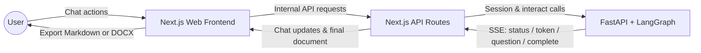
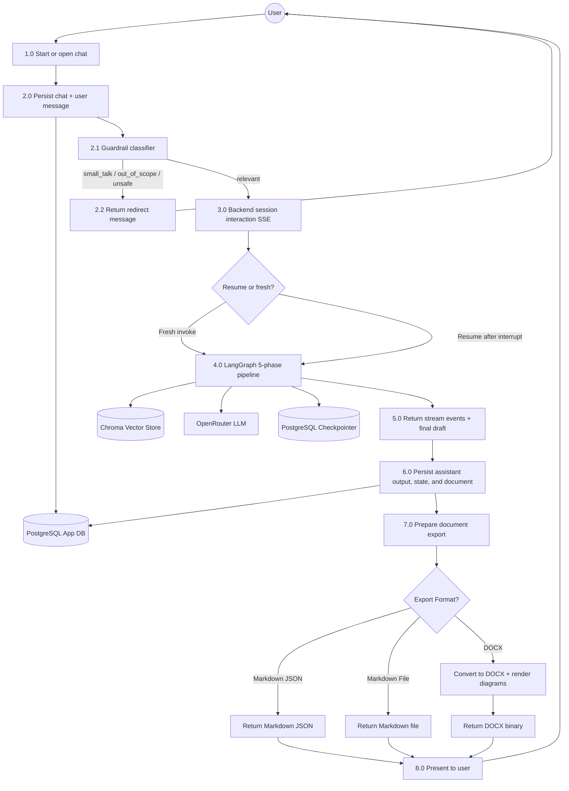
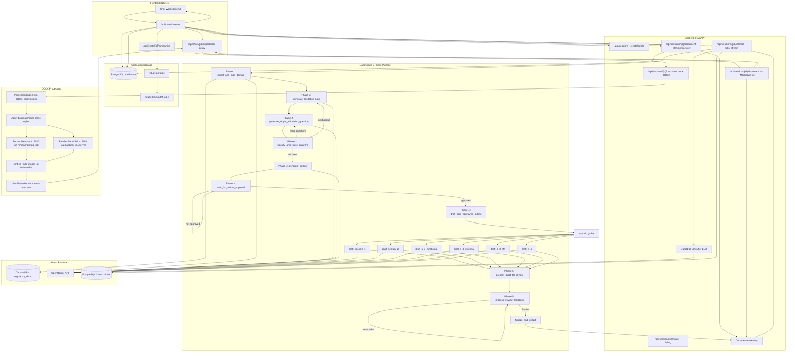

# Data Flow Diagrams

## DFD Level 0 - System Context

## DFD Level 1 - Main Processes

## DFD Level 2 - Detailed Processing

## Data Store Descriptions

| Store | Type | Managed By | Contents |
|---|---|---|---|
| PostgreSQL App DB | Relational (Prisma) | Next.js | Users, Chats, Messages, Runs, Timing stats |
| PostgreSQL Checkpointer | Relational (psycopg3) | LangGraph | Graph checkpoint/state for resumability |
| ChromaDB | Vector Store | ChromaDB | Seeded regulatory documents (IEEE 830, HIPAA, GDPR, etc.) |

## Key Data Flows

1. **Session Creation** → Backend generates UUID thread_id, returned to frontend
2. **Message Interaction** → Frontend proxies message to backend SSE endpoint; backend classifies via guardrail, invokes/resumes graph, streams events back
3. **Graph Execution** → 5-phase pipeline with interrupts; state persisted to PostgreSQL checkpointer
4. **Document Assembly** → Sections combined, formatted, enriched with use-case tables and diagrams
5. **Export** → Markdown returned as JSON or file; DOCX generated with formatted text and embedded diagram images
