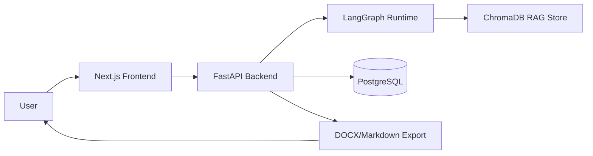
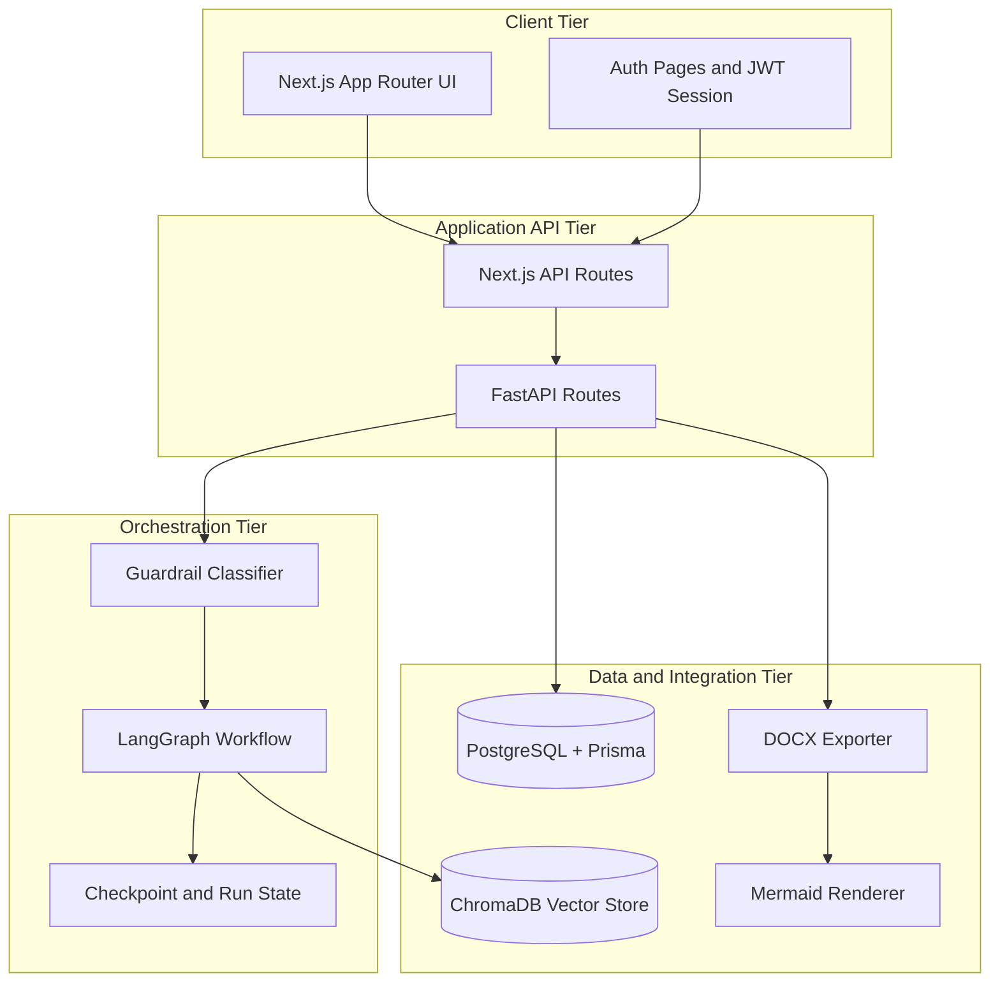
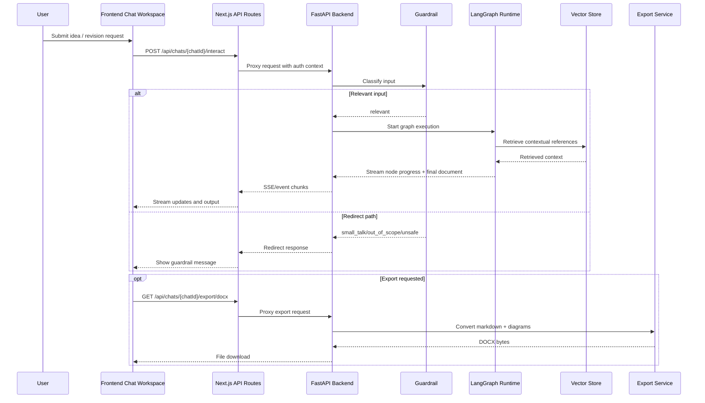
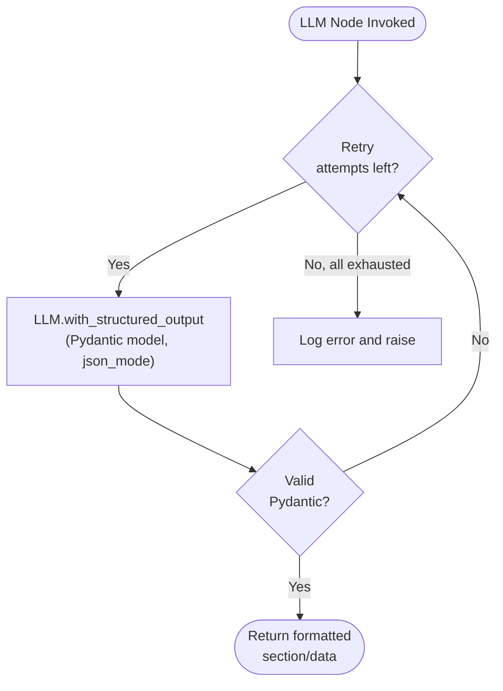

# Design Document

## 1. System Overview

The Automated SRS Generator (ASG) is a full-stack system that converts informal stakeholder ideas into IEEE 830-compliant Software Requirements Specification documents through a 5-phase interactive chat workflow.

### Key Capabilities

- **Interactive Elicitation**: 4-phase Q&A (one question at a time) covering user roles, functional boundaries, NFRs, and edge cases
- **IEEE 830 Compliance**: Auto-generates structured SRS with introduction, overall description, functional/NFR/external interface requirements, and appendices
- **Human-in-the-Loop**: Interrupts at each elicitation question for user feedback
- **RAG Grounding**: Semantic search against seeded regulatory standards (HIPAA, GDPR, PCI-DSS, WCAG, IEEE 830)
- **Dual Diagram Support**: Mermaid diagrams (usecase, class, ER, activity) generated from domain data
- **Multiple Export Formats**: Markdown (JSON or file download) and DOCX with embedded diagrams

## 2. Architecture Design

The solution follows a layered architecture with clear separation between presentation, API, orchestration, and infrastructure concerns.

### Architecture Layers

- **Presentation Layer**: Next.js pages and chat workspace components.
- **API Gateway Layer**: Next.js API routes and backend FastAPI routes.
- **Orchestration Layer**: LangGraph nodes, state transitions, and interruption handling.
- **Data and Integration Layer**: Prisma/PostgreSQL, ChromaDB, Mermaid rendering, and document export.

### Interaction Sequence

## 3. Component Design

### Key Components

- **Frontend Chat Workspace**: Sends user prompts and displays streaming progress/results with live section preview.
- **API Route Proxy**: Validates user session and forwards requests to backend endpoints.
- **Guardrail Classifier**: Filters irrelevant/unsafe input before expensive orchestration (LLM-based, 4 labels).
- **Graph Runtime**: Executes 7-node LangGraph graph for full generation, diagram-only, or revision mode.
- **Vector Store Retriever**: ChromaDB-based semantic search injecting standards-compliant context into prompts.
- **Document Assembly Pipeline**: Combines section drafts, use-case tables, diagrams, and front matter into final SRS.
- **Export Service**: Produces Markdown (JSON/file) and DOCX with embedded Mermaid diagrams.

### LLM Structured Output Strategy

All LLM-invoking nodes use LangChain's `with_structured_output(method="json_mode")` to enforce Pydantic schema validation:

Retry strategy:
1. Initial call with `temperature=0.5`
2. Each retry reduces temperature by 0.1 (down to 0.1 minimum)
3. Maximum 2 retries (3 total attempts)
4. `max_tokens` set to 8192 for full section generation

### Pydantic Models

| Model | Fields | Purpose |
|---|---|---|
| `IngestionSummaryModel` | project_title, domain, project_purpose, target_users, suggested_actors, platform_needs, success_criteria, architecture_summary, components, core_flows, data_entities, external_interfaces, constraints, assumptions | Extracts full project metadata from initial user input |
| `ClarificationQuestionModel` | category, group (0-3), priority, question, suggested_options[], rationale | Single elicitation question |
| `QuestionPlanModel` | topics[] | 2-3 question topics for a group |
| `SubsectionContent` | number, title, content | Numbered subsection |
| `DraftSectionModel` | subsections[] | Drafted SRS section |
| `MermaidDiagramSet` | usecase, class_diagram, er, activity | Set of 4 Mermaid diagrams |

## 4. 5-Phase Workflow Design

### Phase 1: Ingestion
- Node: `ingest_and_map_domain`
- Extracts structured project summary from user's initial informal description
- Output: `IngestionSummaryModel` with title, domain, actors, flows, entities, constraints

### Phase 2: Elicitation (4 Groups, One Question at a Time)
- Nodes: `generate_elicitation_plan` → `generate_single_elicitation_question` → `classify_and_store_answers`
- Each group has 2-3 question topics generated as a lightweight plan
- Questions are asked one-at-a-time with `interrupt()` pauses
- User answers are accumulated in `elicitation_answers[group_N]`
- Groups: User Roles & Flows, Functional Boundaries, NFRs, Edge Cases & Risk Mitigation

### Phase 3: Drafting (6 Parallel Section Writers)
- Node: `draft_from_approved_outline`
- Runs 6 parallel section drafters via `asyncio.gather`:
  - **s1**: Introduction (1.1-1.5)
  - **s2**: Overall Description (2.1-2.5)
  - **s3_functional**: Functional Requirements (3.1.x)
  - **s3_external**: External Interface Requirements (3.2.1-3.2.4)
  - **s3_nfr**: Non-Functional Requirements (3.3-3.6)
  - **s4**: Appendices (A, B, C)
- Each drafter returns structured `SubsectionContent` objects with explicit numbering

### Phase 4: Diagram Generation
- Node: `generate_mermaid_diagrams`
- Generates 4 Mermaid diagrams (usecase, class, ER, activity) based on domain data
- Falls back to template-based diagrams if LLM generation fails

### Phase 5: Finalization
- Node: `finalize_and_export`
- Assembles final document with use-case tables, diagrams, and front matter

## 5. Diagram Generation

### Mermaid Diagrams
Generated by `generate_mermaid_diagrams` node in `nodes.py` with fallback in `_fallback_mermaid_diagrams_for_node()`:
- **Use Case Diagram**: Actors, use cases, system boundary
- **Class Diagram**: Core data entities and relationships
- **ER Diagram**: Entity-relationship model with crow's foot notation
- **Activity Diagram**: Main workflow with states and transitions

Fallback diagrams in `routes.py` (`_fallback_mermaid_diagrams()`) produce a richer set: flowchart, sequence, ER, class, state, and component diagrams.

### PlantUML Diagrams
Generated by `_fallback_plantuml_diagrams()` in `nodes.py`:
- **Use Case Diagram**: Actors, use cases, relationships
- **Component Diagram**: System components and external interfaces
- **Sequence Diagram**: Primary flow interaction
- **Activity Diagram**: Primary workflow with validation branching

## 6. Document Assembly

The final SRS document is assembled by `_format_srs_document()` in `routes.py`:
1. Section drafts are concatenated in order by `assemble_document_from_sections()` in `formatting.py` (s1, s2, s3_functional, s3_external, s3_nfr, s4)
2. Backend formatting applies heading numbering and requirement splitting
3. Use-case catalog and detail tables are appended as Section 5
4. PlantUML and Mermaid diagrams are appended as Section 6
5. Front matter wraps the body with title, document info table, and table of contents

## 7. Progress Tracking and ETA

The backend tracks node execution progress with:
- **Node sequences**: Ordered lists of nodes for each run mode (full with/without diagrams, diagrams-only, section revision)
- **Parallel node handling**: 5 drafting nodes counted as a single step
- **Exponential Moving Average**: Per-node duration estimates updated after each run with `alpha=0.2`
- **SSE status events**: Emit `started`/`finished` events with step number, total steps, elapsed time, and estimated remaining time
