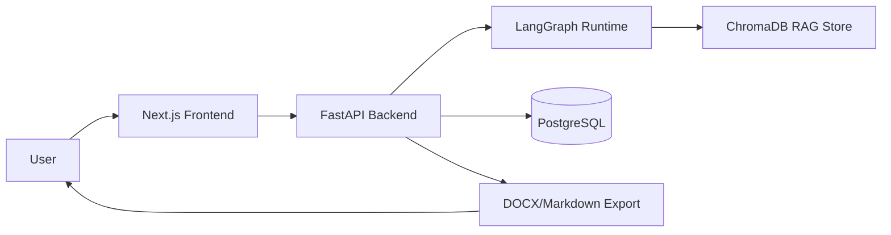
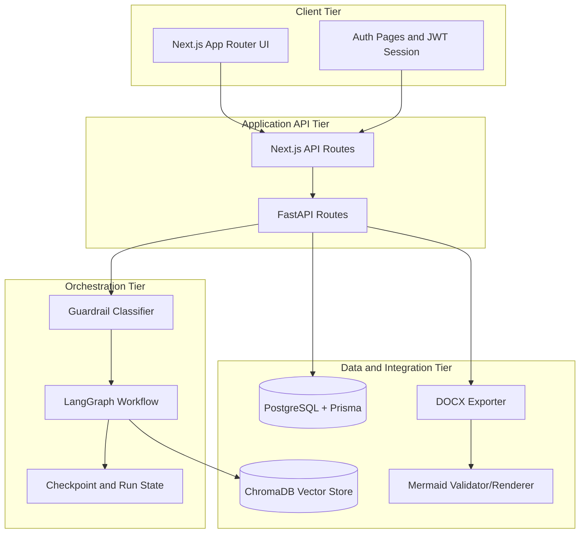
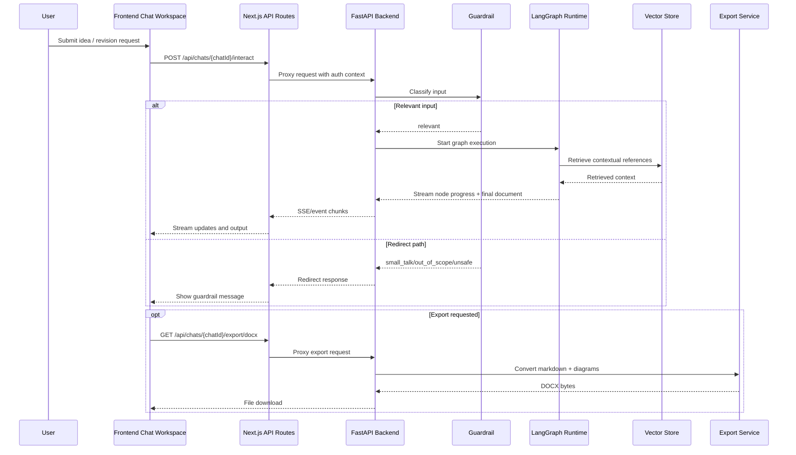
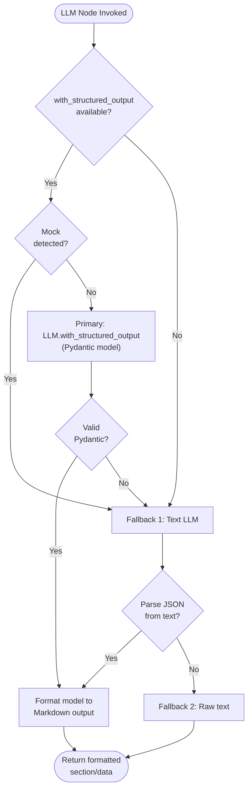
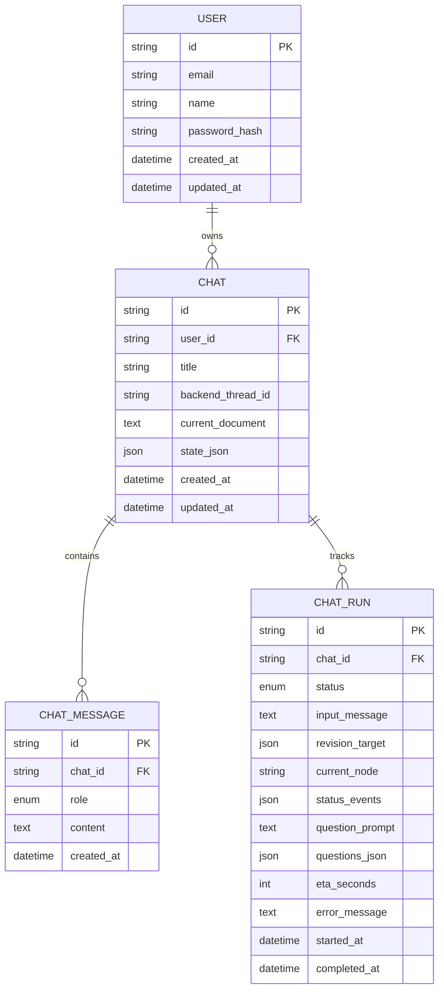
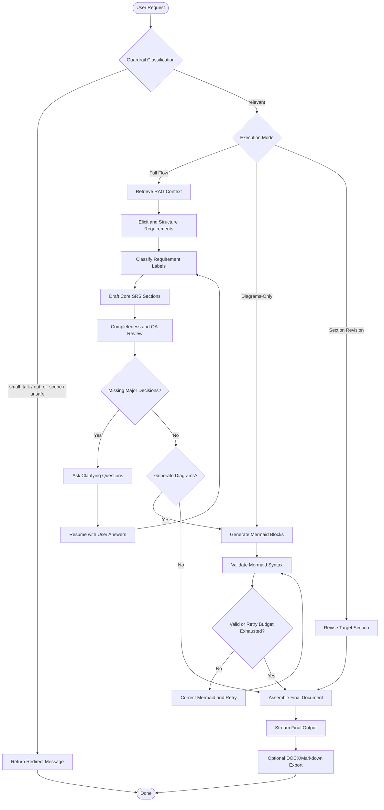

# Design Document

## 1. System Overview

The Automated SRS Generator (ASG) is a full-stack system that helps users create software requirements specifications through an interactive chat workflow. The platform combines:

- A Next.js frontend for authentication, chat interaction, and export actions.
- A FastAPI backend for orchestration, graph execution, and document generation.
- A LangGraph-based workflow for elicitation, drafting, quality checks, and diagram generation.
- A retrieval layer (RAG) to ground outputs in seeded standards and templates.
- A PostgreSQL + Prisma persistence layer for users, chats, messages, and run states.

## 2. Architecture Design

The solution follows a layered architecture with clear separation between presentation, API, orchestration, and infrastructure concerns.

### Architecture Layers

- Presentation Layer: Next.js pages and chat workspace components.
- API Gateway Layer: Next.js API routes and backend FastAPI routes.
- Orchestration Layer: LangGraph nodes, state transitions, and interruption handling.
- Data and Integration Layer: Prisma/PostgreSQL, ChromaDB, Mermaid rendering, and document export.

## 3. Component Design

The core runtime is composed of components that map directly to responsibilities in the generation lifecycle.

### Key Components

- Frontend Chat Workspace: Sends user prompts and displays streaming progress/results.
- API Route Proxy: Validates user session and forwards requests to backend endpoints.
- Guardrail Classifier: Filters irrelevant/unsafe input before expensive orchestration.
- Graph Runtime: Executes node graph for full generation, diagram-only mode, or revision mode.
- Vector Store Retriever: Injects standards-compliant context into prompts.
- Mermaid Validation Pipeline: Validates and retries diagram generation when syntax errors occur.
- Export Service: Produces Markdown and DOCX with embedded diagrams.

## 4. LLM Output Validation and Structured Output

All LLM-invoking nodes use **Pydantic-based structured output** to ensure schema compliance and type safety at the LLM boundary.

### Three-Level Fallback Strategy

### Validation Process

1. **Pydantic Schema Definition** - Each generative node defines a Pydantic `BaseModel` with typed fields and descriptive `Field(description=...)` annotations.
2. **LLM Structured Call** - When available, `llm.with_structured_output(ModelClass)` constrains the LLM response to match the schema exactly.
3. **Mock Detection** - Checks `llm.__class__.__module__` to detect unittest.mock objects and force fallback for tests.
4. **JSON Parsing Fallback** - If structured output unavailable, calls text-based LLM and attempts manual JSON parsing.
5. **Format Conversion** - Valid Pydantic model instances are converted to formatted Markdown section text.

### Pydantic Models

| Model | Fields | Purpose |
|---|---|---|
| `InitialElicitation` | project_title, project_purpose, key_stakeholders, main_features, constraints, preliminary_glossary | Extracts project metadata in `elicit_requirements` |
| `GlossaryEntry` | term, definition | Glossary term/definition pairs |
| `Section1Introduction` | purpose, scope, glossary[], overview | IEEE 830 Section 1: Introduction |
| `UseCase` | name, actor, description, trigger, precondition, basic_steps | System use case definition |
| `SystemEnvironment` | description, actors, external_systems | Product environment context |
| `Section2OverallDescription` | system_environment, primary_use_cases[], user_characteristics, non_functional_overview | Section 2: Overall Description |
| `FunctionalRequirement` | requirement_id, name, trigger, precondition, basic_flow, alternative_flows[], postcondition, exception_paths[] | Complete functional requirement |
| `NonFunctionalRequirement` | category, requirement, rationale | Non-functional requirement (quality attribute) |
| `Section3Requirements` | external_interfaces[], functional_requirements[], non_functional_requirements[] | Section 3: Requirements (all variants: FR, NFR, interfaces) |
| `VerificationEntry` | requirement_id, test_case, acceptance_criteria | Single requirement verification mapping |
| `Section4Verification` | title, description, verification_entries[] | Section 4: Verification Matrix |

## 5. Data Design

The data model stores user ownership, conversational history, and execution state for resumable workflow runs.

### Data Entities

- User: Account identity and credentials.
- Chat: Conversation container associated with one user.
- ChatMessage: Immutable message history within a chat.
- ChatRun: Execution metadata for each generation run.
- StageTimingStat: Aggregate timing to support ETA estimation.

## 6. Workflow Design

The workflow supports three operation modes and includes quality gates plus human-in-the-loop clarification.

### Workflow Stages

- Stage 1: Input and guardrail classification.
- Stage 2: Route to full flow, diagram regeneration, or section revision.
- Stage 3: Full flow performs retrieval, requirement extraction/classification, and section drafting.
- Stage 4: QA and completeness checks trigger clarification when required.
- Stage 5: Diagram validation/correction loop finalizes output for streaming and export.

