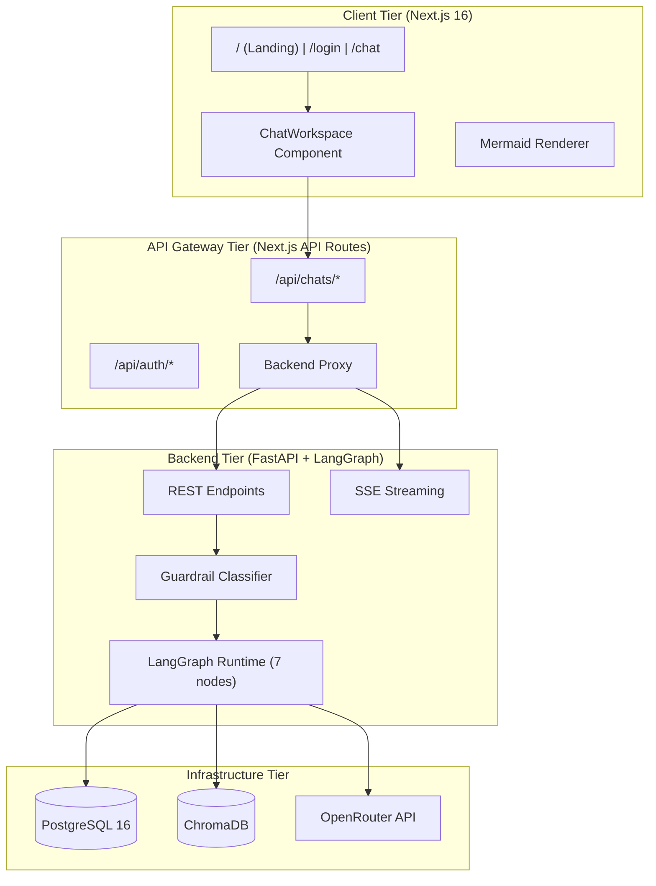
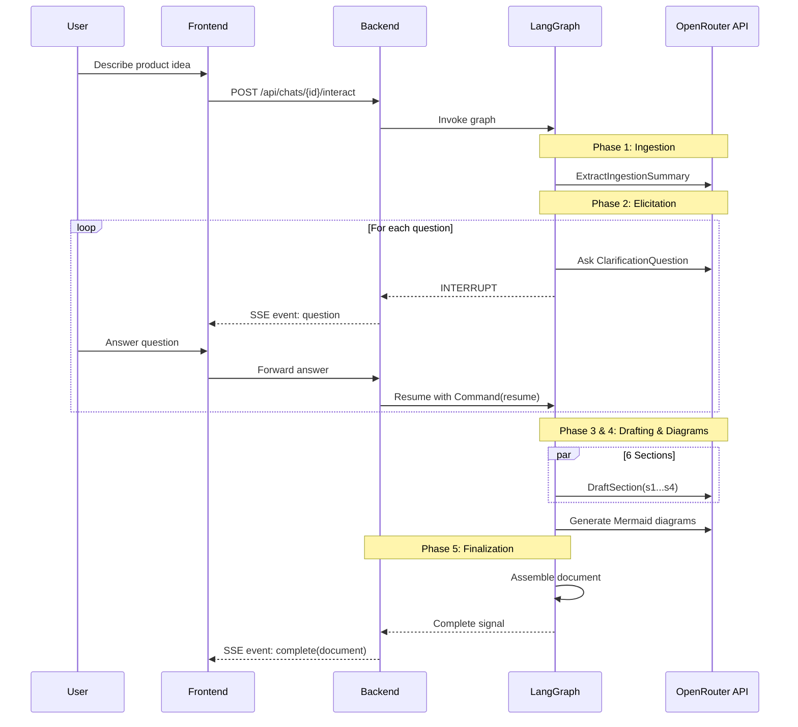
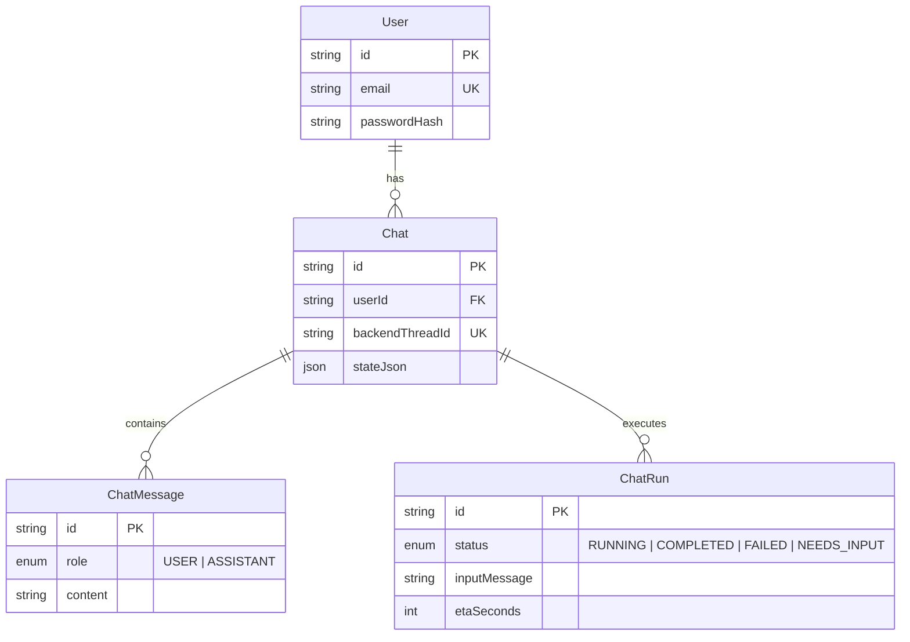

# Software Design Document: AI-Driven SRS Generator

## 1. Overview and Context

### 1.1 Purpose

The AI-Driven Software Requirements Specification (SRS) Generator is a full-stack interactive system that transforms informal stakeholder ideas into IEEE 830 / ISO 29148-compliant SRS documents. It utilizes a recursive multi-agent elicitation workflow, human-in-the-loop (HITL) interrupts, Retrieval-Augmented Generation (RAG) grounded in regulatory context, and automated diagram generation.

### 1.2 Problem Statement

Stakeholders typically express product ideas informally. Manually producing a structured, standards-compliant SRS requires significant effort, deep knowledge of requirements engineering, and multiple rounds of manual clarification. Currently, there is a lack of accessible tools that interactively guide users through this complex process while guaranteeing a compliant output.

### 1.3 Solution Overview

The solution is a **5-phase LangGraph workflow**:

1. **Ingestion:** Parse the informal description into structured domain metadata.
2. **Elicitation:** Ask targeted clarification questions (User Roles, Functional Boundaries, NFRs, Edge Cases), pausing for user input.
3. **Drafting:** Run 6 parallel LLM-based section writers.
4. **Diagram Generation:** Create Mermaid and PlantUML diagrams from domain data.
5. **Finalization:** Assemble the document with front matter, tables, and diagrams.

**Key Capabilities:**

* **Interactive Elicitation:** One question at a time across 4 groups.
* **IEEE 830 Compliance:** Structured sections (Introduction, Description, Specific Reqs, Appendices).
* **RAG Grounding:** ChromaDB semantic search against 6 regulatory standards (HIPAA, GDPR, PCI-DSS, WCAG, IEEE 830).
* **Guardrail Classifier:** LLM-based input filter (relevant, small_talk, out_of_scope, unsafe).
* **Dual Diagram Support:** Mermaid (usecase, class, ER, activity) and PlantUML.
* **Export:** Raw Markdown, JSON, and DOCX (with embedded diagrams).

---

## 2. System Architecture

The system utilizes a 4-tier layered architecture, decoupling the client UI from the orchestration backend.

### 2.1 Technology Stack

| Tier | Technologies | Primary Purpose |
| --- | --- | --- |
| **Frontend** | Next.js 16, React 19, Tailwind CSS 4 | UI, routing, client state |
| **Gateway** | Next.js API Routes | Auth, request proxying |
| **Backend** | FastAPI, Uvicorn, LangGraph, LangChain | REST/SSE endpoints, orchestration |
| **Infrastructure** | PostgreSQL 16, ChromaDB, OpenRouter API | State checkpointing, RAG, LLM |
| **Rendering** | Mermaid CLI, PlantUML, python-docx | Inline/export diagrams, DOCX generation |

### 2.2 Layered Architecture Map

### 2.3 Happy Path Request Flow

---

## 3. Data Design

### 3.1 Entity-Relationship Diagram (Application Data)

### 3.2 Workflow State Schema (`SRSState`)

The core state object flows through all LangGraph nodes. Key components include:

* **`ingestion_summary`:** 14 domain metadata fields (project_title, target_users, constraints, etc.).
* **`elicitation_answers`:** Stored context mapping back to generated questions.
* **`sections`:** Document fragments generated during Phase 3 parallel drafting.
* **`mermaid_blocks` / `plantumul_diagrams`:** Validated diagram syntaxes.
* **`rag_context`:** Strings retrieved from ChromaDB.

### 3.3 Vector Store (RAG)

ChromaDB is utilized with the `all-MiniLM-L6-v2` embedding model. It initializes by seeding 6 core documents (IEEE 830, GDPR, HIPAA, PCI-DSS, WCAG, and an extended SRS template). Queries perform a cosine similarity search (`top-5`, `k=5`) to inject context into LLM system prompts.

---

## 4. API & Integration Design

### 4.1 Backend Endpoints (FastAPI)

* **`POST /api/sessions`**: Create a new elicitation session thread.
* **`POST /api/sessions/{thread_id}/interact`**: Send messages and stream Server-Sent Events (SSE). Accepts full generation, diagrams-only, or section-revision modes.
* **`GET /api/sessions/{thread_id}/document.docx`**: Assemble and download the final DOCX, triggering server-side diagram rendering (`mmdc`).

### 4.2 SSE Streaming

Real-time progress is relayed back to the Next.js client via EventSource:

* `token`: Streamed text chunks for live reading.
* `status`: Current node execution, step count, and EMA-based ETA calculation.
* `question`: Human-in-the-loop interruption payloads.
* `complete`: The final compiled SRS Markdown document.

### 4.3 Authentication

Stateless authentication uses JWTs (HS256 signature, 7-day expiry). Next.js API routes (`/api/auth/login`, `/api/auth/signup`) handle password hashing (bcrypt, 12 rounds) and set `httpOnly` secure cookies.

---

## 5. User Interface (UI) Design

### 5.1 Workspace Layout

The core workspace (`/chat`) utilizes a 3-column responsive grid:

1. **Left (260px):** Chat history sidebar (CRUD operations for past documents).
2. **Center (Flexible):** Interactive generation zone. Displays chat bubbles, clarification forms, and the active generation progress indicator (ReceivingBubble with ETA).
3. **Right (420px):** SRS Draft preview. Features section accordions, inline Mermaid SVG rendering, and targeted revision editing tools.

### 5.2 Interaction States

* **Empty:** Prompt for the initial product description paragraph.
* **Elicitation:** Form cards displaying priority questions and suggested chips.
* **Generation:** A progress bar with steps completed, elapsed time, and dynamic ETA.
* **Targeted Revision:** A focused UI allowing the user to select specific requirements (e.g., *3.1 User Authentication*) and instruct the LLM to rewrite only that portion without regenerating the entire SRS.

### 5.3 Color System

CSS custom properties handle automatic Light/Dark theming.

* *Primary:* Blue-600 (`#2563eb`) / Blue-400 (`#60a5fa`)
* *Surfaces:* Slate-50 (`#f8fafc`) to Slate-800 (`#1e293b`) for depth.

---

## 6. Component Design

### 6.1 Frontend Component Hierarchy

* **`ChatWorkspace` (Main Controller):** Manages 35+ state variables, SSE parsing, and polling for active runs.
* **`MarkdownContent`**: Custom markdown renderer supporting heading enumeration and requirement splitting.
* **`ClarificationFormCard`**: Handles the HITL interrupt data collection.
* **`SelectedDraftBubble`**: Isolates section context when `revision_mode` is triggered.

### 6.2 Backend LangGraph Topology

The state graph relies on strictly typed Pydantic models for structured output generation (`json_mode`).

* **Routing Logic:** Node responses determine if the graph should proceed to drafting, loop back for another question, or suspend execution.
* **Parallel Processing:** `asyncio.gather` is used during the drafting phase to run the 6 section drafters concurrently, significantly reducing TTFB (Time to First Byte) for the final document.
* **Diagram Validation:** The diagram node features a two-tier validation system: it first attempts to validate Mermaid syntax via the `mmdc` CLI subprocess. If that fails, it falls back to a regex heuristic and triggers an LLM correction prompt.

---

## 7. Assumptions, Dependencies & Constraints

### 7.1 Assumptions & Dependencies

* **External LLM Access:** The system relies entirely on the OpenRouter API (OpenAI-compatible models) and assumes reliable internet access. There is no local LLM fallback.
* **Docker / Postgres:** PostgreSQL 16 is mandatory for LangGraph checkpointing. (MemorySaver is implemented strictly as a fail-safe for development).
* **User Proficiency:** The initial input must represent a reasonable product concept. The LLM cannot extrapolate a complex enterprise architecture from a 3-word prompt without heavy hallucination.
* **Runtimes:** Pinned to Node.js 20+ and Python 3.11+.

### 7.2 Architectural Constraints & Mitigations

| Constraint | Mitigation Strategy |
| --- | --- |
| **State persistence overhead** | LangGraph interrupts require constant DB checkpointing. Mitigated by using an `AsyncPostgresSaver` connection pool. |
| **Sequential Elicitation Bottleneck** | Asking one question at a time can frustrate users. Mitigated by limiting to 4 groups of 2-3 questions max, and providing "suggested answer" chips. |
| **Context Window Limits** | Capped at `max_tokens=8192`. Mitigated by splitting the draft process into 6 parallel sub-tasks rather than requesting one monolithic document. |
| **Diagram Syntax Failures** | LLMs struggle with perfect Mermaid syntax. Mitigated via the two-tier validation loop and static template fallbacks. |