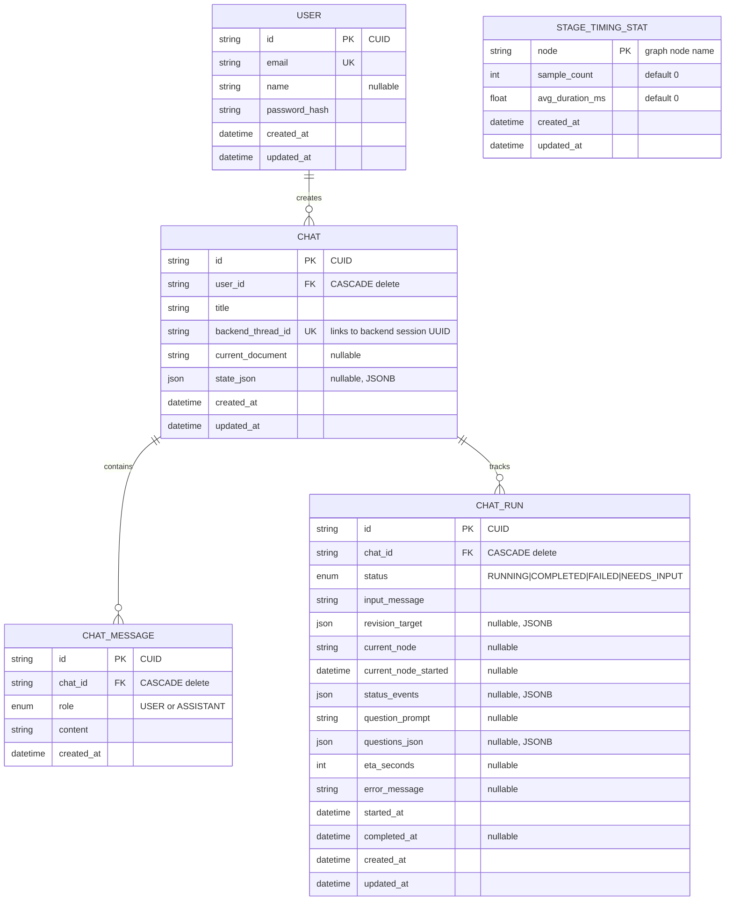

# Entity-Relationship Diagram

This diagram reflects the implemented Prisma schema used by the frontend app
(`frontend/prisma/schema.prisma`). All five models are shown with their
relationships, primary keys, unique constraints, and foreign keys.

## Entity Descriptions

### USER
- Primary entity representing authenticated system users.
- Stores email (unique), optional display name, and bcrypt password hash.
- One-to-many relationship with CHAT — deleting a user cascades to all their chats.

### CHAT
- Represents a user conversation tied to a backend LangGraph session.
- `backendThreadId` (unique) links to the backend's session UUID used for graph checkpointing.
- Stores the latest generated document (`currentDocument`) and a JSONB snapshot
  of the LangGraph state (`stateJson`) for the right-panel section preview.
- One-to-many relationships with CHAT_MESSAGE and CHAT_RUN.
- Indexed on `(userId, updatedAt)` for efficient chat list queries.

### CHAT_MESSAGE
- Individual messages exchanged in a chat session.
- Role is an enum: `USER` (human input) or `ASSISTANT` (AI response).
- Indexed on `(chatId, createdAt)` for chronological retrieval.

### CHAT_RUN
- Tracks the execution state of a single graph invocation within a chat.
- Status lifecycle: `RUNNING` → `COMPLETED` | `FAILED` | `NEEDS_INPUT`.
- Records the currently executing graph node, SSE status events (JSONB),
  clarification questions, ETA estimate, and any error message.
- `revisionTarget` (JSONB) stores metadata when the run is a section revision.
- Indexed on `(chatId, startedAt DESC)` and `(chatId, status)` for efficient
  active-run lookups.

### STAGE_TIMING_STAT
- Singleton-per-node table tracking average execution duration across all runs.
- Used by the frontend ETA estimation logic in `chat-runner.ts`.
- `node` is the primary key (e.g. `"draft_section_1"`, `"generate_mermaid"`).
