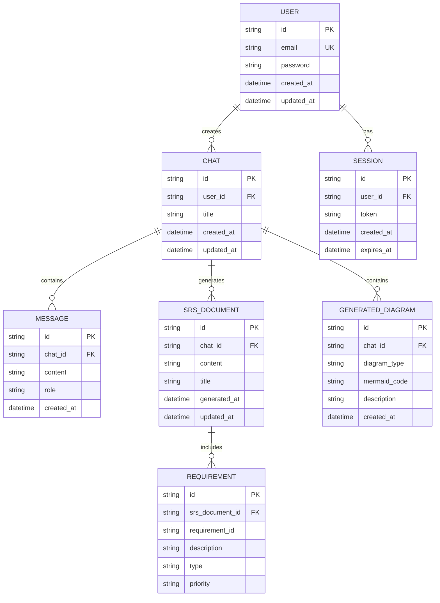

# Entity-Relationship Diagram

This diagram shows the database schema and relationships for the system.

## Entity Descriptions

### USER
- Primary entity representing system users
- Stores authentication credentials and metadata
- One-to-many relationship with CHAT and SESSION

### CHAT
- Represents a conversation/SRS generation session
- Links users to their conversations
- Contains multiple messages and generated documents

### MESSAGE
- Individual messages in a chat session
- Stores both user queries and system responses
- Includes role identifier (user/assistant)

### SRS_DOCUMENT
- Generated SRS documents
- References the chat that generated it
- Contains the complete SRS content

### GENERATED_DIAGRAM
- Mermaid diagrams generated during SRS creation
- Includes activity, class, data flow, and ER diagrams
- Stores actual Mermaid code and descriptions

### REQUIREMENT
- Individual requirements extracted from SRS
- Organized by type and priority
- Links back to parent SRS document

### SESSION
- Manages user authentication sessions
- Stores authentication tokens
- Tracks session expiration
