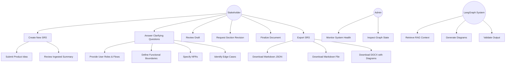
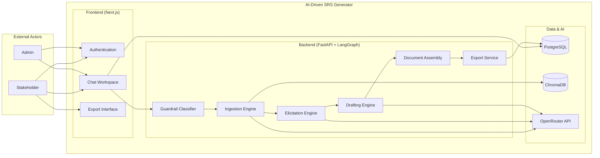

# Use Case Diagram

## High-Level System Use Cases

## Actor Descriptions

| Actor | Description |
|---|---|
| **Stakeholder** | Primary user who provides product ideas, answers questions, reviews drafts, and exports the final SRS |
| **Admin** | Secondary user who monitors system health and debugs graph execution state |
| **LangGraph System** | Automated backend system that orchestrates the 5-phase workflow, LLM calls, and RAG retrieval |

## Use Case Descriptions

| ID | Use Case | Description | Primary Actor |
|---|---|---|---|
| UC-01 | Create New SRS | Submits an informal product idea and receives a structured ingestion summary | Stakeholder |
| UC-02 | Answer Clarifying Questions | Responds to one-at-a-time elicitation questions across 4 groups | Stakeholder |
| UC-03 | Review Draft | Reviews the complete SRS draft and provides feedback or finalization command | Stakeholder |
| UC-04 | Request Section Revision | Requests regeneration or inline edits for specific sections of the draft | Stakeholder |
| UC-05 | Finalize Document | Issues the finalize command to complete the SRS document | Stakeholder |
| UC-06 | Export SRS | Downloads the completed SRS as Markdown JSON, Markdown file, or DOCX | Stakeholder |
| UC-07 | Monitor System Health | Checks the `/health` endpoint for model name and graph readiness | Admin |
| UC-08 | Inspect Graph State | Views raw LangGraph state via the debug endpoint for troubleshooting | Admin |
| UC-09 | Retrieve RAG Context | Performs semantic search against seeded regulatory documents for context injection | LangGraph System |
| UC-10 | Generate Diagrams | Creates Mermaid and PlantUML diagrams from ingested domain data | LangGraph System |
| UC-11 | Validate Output | Runs guardrail classification on user messages and validation on generated diagrams | LangGraph System |

## System Boundary

